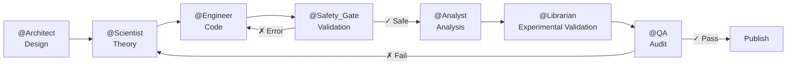

# System Architecture

## Expert Council (7 Agents)

This project implements a **Council of 7 Specialized Experts** that collaboratively develop, validate, and deploy scientific content:

## Agent Roles

| Agent | Responsibility | External Skills |
|-------|---------------|-----------------|
| **@Architect** | Structure guardian and project memory | `senior-architect`, `agent-memory-systems` |
| **@Scientist** | Theory owner, LaTeX notation | `claude-scientific-skills`, `research-engineer` |
| **@Engineer** | Code builder, implementation | `python-pro`, `ml-pipeline-workflow` |
| **@Safety_Gate** | Numerical validation, toxicology, pedagogy | `stability_guardian`, `toxicity_predictor`, `socratic_debugger` |
| **@Analyst** | Deep analysis and visualization | `data-storytelling`, `descriptor_miner` |
| **@Librarian** | Experimental validation (Materials Project) | `librarian_rag` |
| **@QA** | Supreme quality auditor | `systematic-debugging`, `code-review-excellence` |

## External Skills

Modular skills developed for scientific validation:

### Numerical Skills
- `stability_guardian.py` — MD timestep validator
- `basis_set_architect.py` — Gaussian basis set recommender for DFT

### AI Mining Skills
- `toxicity_predictor.py` — Molecular toxicity predictor

### Pedagogy Skills
- `socratic_debugger.py` — Socratic pedagogical feedback generator

### Orchestration Skills
- `librarian_rag.py` — RAG for experimental validation

## Why Python 3.11?

| Library | Python 3.10 | Python 3.11 | Python 3.12 |
|---------|-------------|-------------|-------------|
| RDKit   | ✓ Stable    | ✓✓ Optimal  | ⚠️ Beta     |
| ASE     | ✓           | ✓✓          | ✓           |
| OpenMM  | ✓           | ✓✓          | ❌          |

Python 3.11 offers maximum compatibility with the complete scientific stack used in this course.
